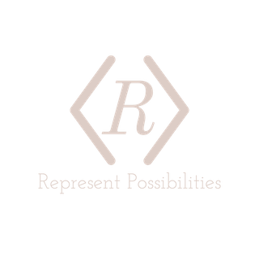

# 

&nbsp;&nbsp;
&nbsp;&nbsp;

Hi there 👋, I'm Courtney Revada!

I am web developer who is passionate about learning and creating code for change. I am beginning to create online content to showcase my work and my passions. Be sure to check it out! When I am not coding I like to focus my attention towards building solutions for the foster care community. I aim to Represent Possibilities in society because I believe any one can and should be successful in life!

---

- 🔭 I’m currently working on bettering the payment system in healthcare
- 🌱 I’m currently learning Azure Serverless Functions
- 👯 I’m looking to collaborate on anything!
- 💬 Ask me about how to help increase the likelihood of getting foster youth into tech
- 😄 Pronouns: He/Him
- ⚡ Fun fact: I have two brown belts in judo and jiu jitsu

